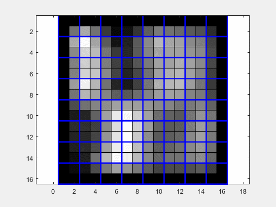

# Fast Dense Feature Extraction for CNNs
An approach to compute patch-based local feature descriptors efficiently in
presence of pooling and striding layers for whole images at once.

A Pytorch implemention of the paper *"Fast Dense Feature Extraction with CNNs with Pooling Layers"*
https://arxiv.org/abs/1805.03096 

<B>Abstract</B>:
In recent years, many publications showed that convolutional neural network based features can have a superior performance to engineered features. However, not much effort was taken so far to extract local features efficiently for a whole image. In this paper, we present an approach to compute patch-based local feature descriptors efficiently in presence of pooling and striding layers for whole images at once. Our approach is generic and can be applied to nearly all existing network architectures. This includes networks for all local feature extraction tasks like camera calibration, Patchmatching, optical flow estimation and stereo matching. In addition, our approach can be applied to other patch-based approaches like sliding window object detection and recognition. We complete our paper with a speed benchmark of popular CNN based feature extraction approaches applied on a whole image, with and without our speedup, and example code (for Torch) that shows how an arbitrary CNN architecture can be easily converted by our approach.
## Getting Started
These instructions will explain how to use the Fast Dense Feature Extraction (**FDFE**) project.

### Prerequisites
* Python>=3.5
* pytorch>=1.0
* numpy
* matplotlib

### Installing

1) Install all prerequisites.
2) Clone the project

## Project Structure


* ```FDFE.py``` - implementation of the all approach layers and pre & post process methods as described in the paper
,  including: 

  * MultiMaxPooling
  * MultiConv
  * multiPoolPrepare
  * unwarpPrepare
  * unwarpPool 
* ```BaseNet.py``` - This referes to an implementation of a pre-trained CNN  on training patches . 
* ```SlimNet.py``` - This referes to the implementation of .
* ```test_example.py``` - test run


## Running the tests


Now you should ```test_example.py``` to make sure that FDFE project works correctly.

The test generates a random input image
 
 of size ```imH X imW```  and evaluates it on both 
  

.

The script continues and evaluates differences between both CNN's outputs and performs speed benchmarking.

There are two modes of operation for 
 
:
* ***singlePatch*** mode- run 
 
over a single patch ```pH x pW```
that would get cropped from input image
 
around ```I(patch_j_center,patch_i_center)```

* allPatches

 
### Possible arguments
In ```test_example.py``` there are initial parameters that could be adjusted: 
* Tested Input Image dimensions:
<pre>
- <b>imH</b> - Input image height  
- <b>imW</b> - Input image width

- <b>sL1</b> - First stride value 
- <b>sL2</b> - Second stride value
.
.
.
- <b>sLn</b> - n-th stride value
</pre>
 

*  <b>singlePatch</b> mode:

<pre>
- <b>pW</b> - patch Width - current implementation supports only odd width size
- <b>pH</b> - patch Height - current implementation supports only odd width size
- <b>patch_i_center</b> - patch row center
- <b>patch_j_center</b> - patch column center
</pre>
 
 *  <b>allPatches</b> mode:
<pre>
- <b>batch_size</b> - number of patches to be evaluated at the same time 
</pre>
 


### Expected output
Script outputs the following:
* aggregated difference between base_net () output and slim_net output
()
* For , an averaged evaluation per patch
* For , Total evaluation per frame. i.e. the entire input image

Expected verbose would look like: (depends on  running  mode): 
<pre>
Total time for C_P: 0.017114248275756836 sec
------------------------------------------------------------
Averaged time for C_I per Patch without warm up: 0.0010887398617342114 sec
------- Comparison between a base_net over all patches output and slim_net -------
aggregated difference percentage = 0.0000000000 %
maximal abs difference = 0.0000000000 at index i=0,j=0
------------------------------------------------------------
</pre>
## To use your own network

In order to use your own pre-trained network that operates on patches you would need to:
* implemented your network in ```BaseNet.net```
* modify ```SlimNet.py``` accordingly:
    * Duplicate `BsetNet.py` model layers according to its order, e.g. 
    <pre>
    self.conv1 = list(base_net.modules())[<b>change_this_index</b>]</pre> 
    * For every `MaxPool2d` layer place `multiMaxPooling` instead with the decided stride value (<i>sLn</i>)
    * Deplicate unwrapPool layers according to the number of `multiMaxPooling` in your model
    *  Do not remove the following layers - multiPoolPrepare, unwrapPrepare
    
## Contributing

Contributions are always welcome! Please read the [contribution guidelines](contributing.md) first.
## Authors

* Erez P.  (erezposner@gmail.com)
* Arnon K. (--------------)


## Acknowledgments

A big thanks to the following individuals for designing the approach:

- Christian Bailer (christian.bailer@dfki.de)
- Tewodros A. Habtegebrial (tewodros_amberbir.habtegebrial@dfki.de)
- Kiran Varanasi1 (kiran.varanasi@dfki.de)
- Didier Stricker (didier.stricker@dfki.de)
